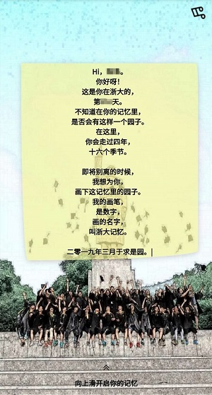

# zju-memory

   [](https://api.96486d9b.cn)

   

人生到处知何似，应似飞鸿踏雪泥。离开之前，重拾你的浙里记忆。

## run

> fill in app/config.ini first

```bash
cd app
virtualenv venv
source venv/bin/activate
pip install -r requirements.txt
python app.py
```

```
docker build -t memory:1.0 .
docker run -it --rm -p 5000:5000 memory:1.0
```

> view it in your browser → http://localhost:5000/

## pics

紫金港竺像 - 玉泉毛像 - 紫金港启真湖畔 - 之江礼堂 - 华家池水 - 西溪图书馆 - 海宁一角 - 舟山灯塔

## snapshot

